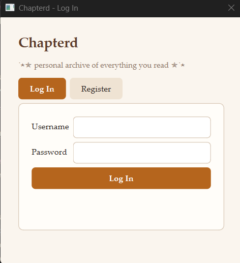
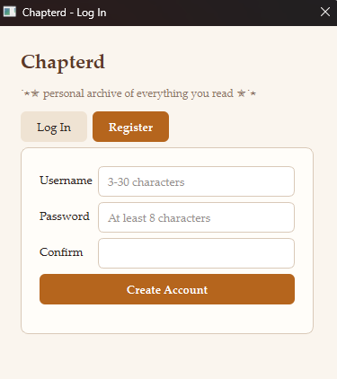
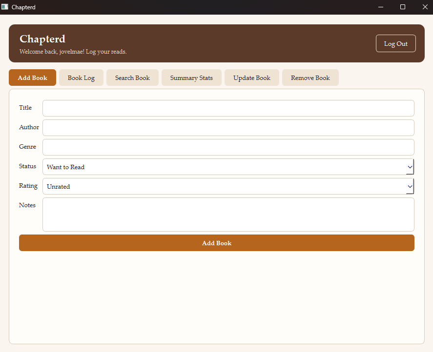
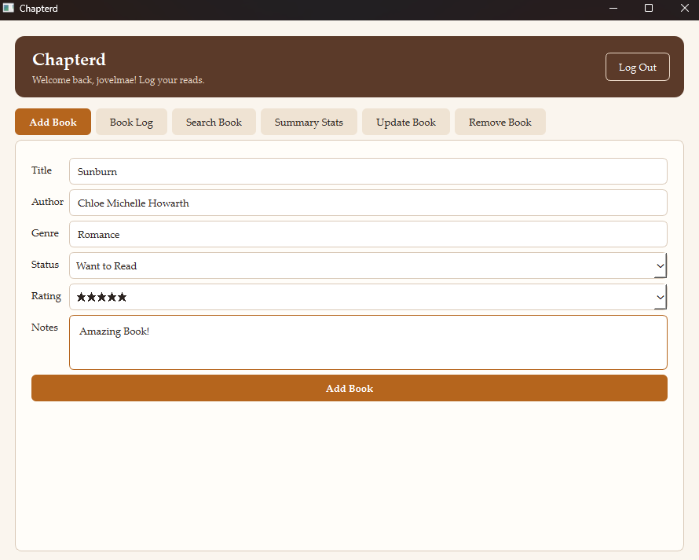
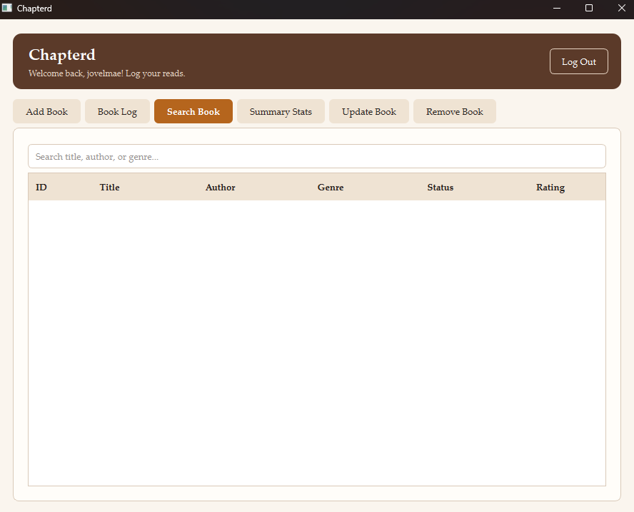
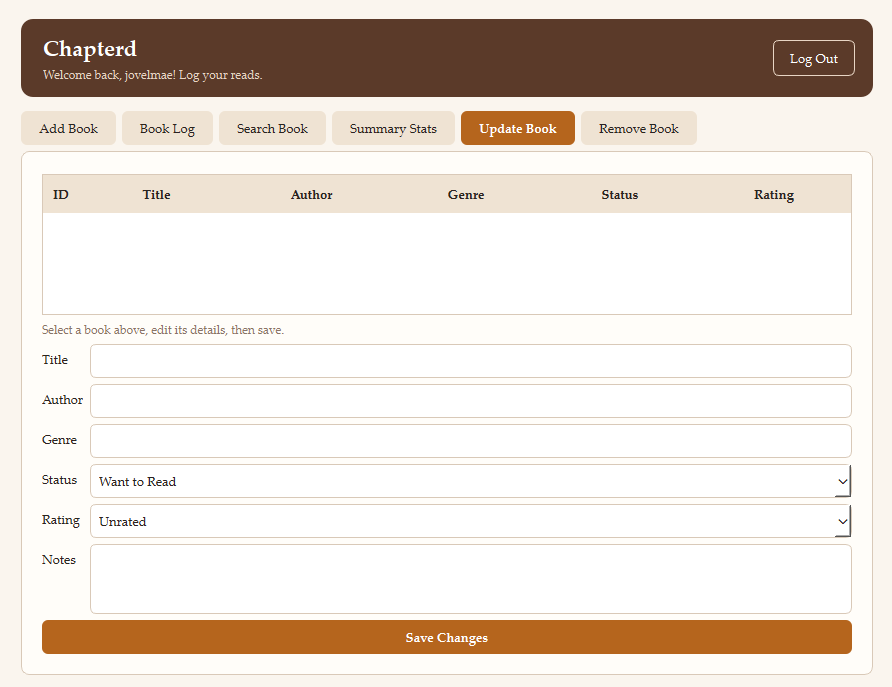
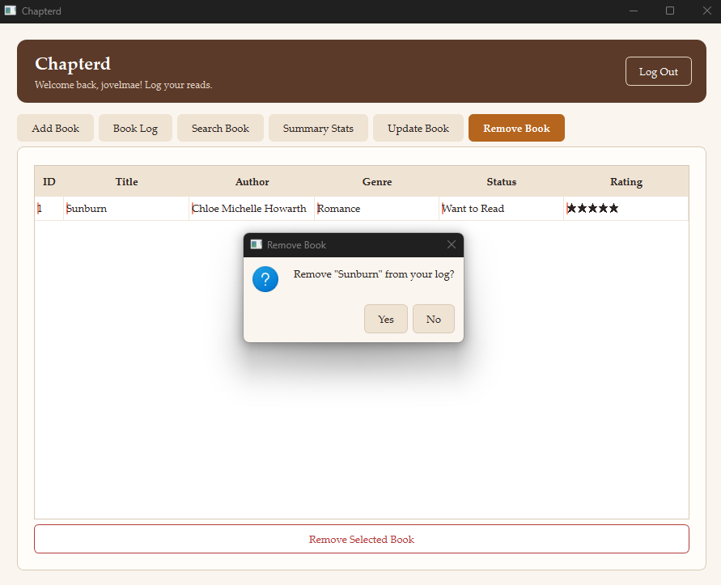
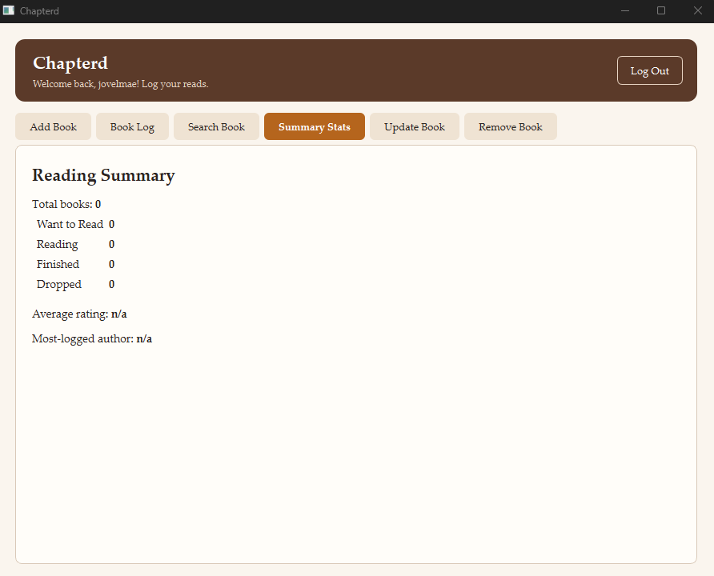

# Chapterd

The system is a desktop-based book log application developed using Python and PyQt6. It allows users to create an account and manage their personal reading records. Users can add books they have read, search for specific books, update book information, remove records, and view a summary of their reading activity.

The system addresses the need for a simple and organized way to keep track of books. Instead of relying on handwritten notes or scattered files, users can store their reading information in one application and easily access, update, and review their book records. It also provides reading statistics to help users see and understand their reading progress.

When you type a title, the app suggests matching books from [Open Library](https://openlibrary.org) and fills in the author and genre for you. This needs an internet connection; everything else works offline.

## Project Objectives

The main objectives of the project are to:
- Organize books based on their reading status: Read, Currently Reading, Want to Read, and Dropped.
- Track and monitor the user’s reading progress.
- Maintain a personal record of books read and collected.
- Provide a simple and convenient way to manage a personal reading archive.
- Allow users to add, search, update, and remove book records easily.
- Provide reading summaries and statistics to help users review their reading activity.

## Features

The major functions of the system include:
* **User Account Management** – Allows users to create an account and log in to access their personal book records.
* **Add Books** – Allows users to add books and record important details such as title, author, reading dates, rating, and favorite quotes.
* **Book Organization** – Organizes books according to their reading status: Read, Currently Reading, Want to Read, and Dropped.
* **Search Books** – Allows users to quickly find a specific book from their personal collection.
* **Update Book Records** – Allows users to edit or update the information of their saved books.
* **Delete Books** – Allows users to remove books from their personal book log.
* **Reading Progress Tracking** – Helps users monitor their reading activity and progress.
* **Reading Summary and Statistics** – Displays a summary of the user’s reading activity and book records.
* **Personal Book Archive** – Keeps the user’s book records organized in one place for easy access and management.

## Technologies Used

* Programming Language
Python 3.10 or newer – Used as the main programming language for developing the system.
* GUI Framework/Library
PyQt6 – Used to create the desktop graphical user interface (GUI) of the application.
* Database
SQLite – Used to store and manage user accounts, book records, reading statuses, and other system data.
* Other Important Libraries or Tools Used
API – Used to retrieve book-related information and help reduce the need for users to manually enter book details.
Python Standard Libraries – Used for additional functions such as data processing, file handling, and security.


## Project Structure

The first run creates `chapterd.db` in the same folder. That file holds your accounts and books. It is local only and ignored by Git.

```
chapterd_qt/
├── main.py                      app entry point and main window
├── style.qss                    app colors and styling
├── requirements.txt             Python packages needed
├── database/database.py         all SQLite access (accounts and books)
├── features/authentication/     login and register (service = logic, view = screen)
└── features/books/              book log screens, rules and Open Library suggestions
```

## Installation and Setup

Before running the system, make sure the following are installed:

- Python 3.10 or newer
- PyQt6
- SQLite3
- Internet connection for the book API
- A code editor or IDE, such as Visual Studio Code / PyCharm

**Step-by-Step Installation**

1. Install Python
- Download and install Python 3.10 or newer.
- Make sure Python is added to the system PATH during installation.
- Verify the installation by opening a terminal and running:
_python --version_
2. Open the Project
- Open the chapterd_qt project folder using PyCharm or another code editor.

3. Create a Virtual Environment
    _python -m venv venv_

4. Activate the Virtual Environment

- For Windows:
_venv\Scripts\activate_

5. Install PyQt6

- _pip install PyQt6_

6. Install Other Dependencies

- Install the required libraries listed in the requirements.txt file:
_pip install -r requirements.txt_

7. Set Up the Database

- SQLite is used as the database and does not require a separate database server.
The application will use the existing database file or create the required database tables when the system is first run.

8. Run the Application

- In the project folder, run:
_python main.py_

9. Log In or Create an Account
- Create a new account if you are a new user.
- Log in to access the main book log system.

**Required Dependencies**

The main dependencies used by the project include:

* Python 3.10+
* PyQt6 – for the graphical user interface
* SQLite3 – for database management
* Requests or another API library – for connecting to the book API
* Python Standard Library – for built-in functions such as hashing, file handling, and database operations

## How to Use the System

The basic steps for using the Chapterd application are:

1. Open the Application
- Run main.py to launch the Chapterd desktop application.
2. Create an Account
- If you are a new user, select the registration option.
- Enter the required account information and create your account.
3. Log In
- Enter your registered username and password to access the main system.
4. Add a Book
- Add a book to your personal library by entering or retrieving its book information through the available API.
5. Set the Reading Status
- Organize the book by selecting a status such as Read, Currently Reading, Want to Read, or Dropped.
6. Manage Book Records
- Search for books in your collection.
- Update book information when needed.
- Delete book records that are no longer needed.
7. Track Reading Progress
- Update the status and reading details of books to keep track of your reading activity.
8. View Reading Summary
- Check the summary and statistics to see an overview of your reading activity.
9. Log Out
- Log out of the account when finished using the application to keep the account secure.

## OOP Implementation

The Chapterd system uses Object-Oriented Programming (OOP) to organize its different functions into classes and objects. This makes the code easier to manage, reuse, and maintain.

**Important Classes and Objects**

* **`MainWindow`** – Manages the main interface of the application where users can view and manage their books.
* **`LoginWindow`** – Handles the user login process and checks the user's account information.
* **`RegisterWindow`** – Allows new users to create an account.
* **`Book`** – Represents a book and stores information such as its title, author, reading status, rating, and reading dates.
* **`BookManager`** – Handles book-related operations such as adding, searching, updating, and deleting books.
* **`Database`** – Handles the connection and operations with the SQLite database.
* **`BookAPI`** – Connects to the external book API to retrieve book information.

#### OOP Concepts Used

* **Encapsulation** – Related data and functions are grouped inside their respective classes. For example, the `Book` class contains the information about a book, while `BookManager` handles operations involving book records. This keeps each part of the system organized.

* **Inheritance** – The system uses inheritance through PyQt6 classes. For example, custom window classes can inherit from classes such as `QMainWindow` or `QDialog`. This allows the application to use the built-in features of PyQt6 while adding its own functions.

* **Polymorphism** – Polymorphism is present through the use of PyQt6 widgets and inherited classes. Custom classes can use or override behaviors provided by their parent classes while providing functionality specific to the LetterBook system.

Overall, OOP allows the Chapterd system to separate its user interface, book management, database, authentication, and API functions into organized and manageable components.


## Database

Chapterd uses **SQLite** as its database. The database stores user accounts and book records, allowing information to be saved and accessed whenever the user opens the application.

#### Database Structure

The database is organized into tables that store different types of information. The important tables include:

* **`users`** – Stores user account information such as the user ID, username, and password.
* **`books`** – Stores the user's book records, including the book title, author, reading status, rating, reading dates, and other book details.

The tables are connected using user identifiers so that each user's book records are associated with their own account.

#### Database Operations

Chapterd performs the following major database operations:

* **Create** – Adds new user accounts and new book records to the database.
* **Read** – Retrieves saved user and book information so it can be displayed in the application.
* **Update** – Allows users to edit book information, such as the reading status, rating, or reading dates.
* **Delete** – Removes book records that the user no longer wants to keep.
* **Search** – Searches the database for specific books based on information such as the title or author.

These operations allow Chapterd to efficiently store, manage, and retrieve the user's personal reading records.

## Screenshots

The following screenshots show the important parts and main functions of the Chapterd application.

✮ The login screen allows registered users to enter their username and password to access their Chapterd account.



✮ The registration screen allows new users to create an account by providing the required information.



✮ The main dashboard displays the user's book collection and provides access to the different features of Chapterd.



✮ The Add Book screen allows users to add a book to their personal collection and enter important information such as the title, author, reading status, rating, and reading dates.



✮ The search feature allows users to find specific books in their collection quickly using information such as the book title or author.



✮ This section allows users to view and manage their book information. Users can update existing records or remove books from their collection.



✮ This section allows users to remove a book from their collection. Users can select a book and delete its record from the system.



✮ The reading summary displays an overview of the user's reading activity, including their book records and reading progress.



## Testing

The Chapterd application was tested to make sure that its main features work correctly and produce the expected results. Different test cases were performed for account management, book management, searching, database operations, and reading statistics.

| Test Case             | Expected Result                                                                             | Actual Result                                                               | Status     |
| --------------------- | ------------------------------------------------------------------------------------------- | --------------------------------------------------------------------------- | ---------- |
| **User Registration** | A new user account should be created when valid information is entered.                     | The account was successfully created and saved in the database.             | **Passed** |
| **User Login**        | The user should be able to log in using valid account information.                          | The user was successfully logged in and directed to the main application.   | **Passed** |
| **Add Book**          | A new book should be added to the user's book collection.                                   | The book was successfully added and displayed in the book list.             | **Passed** |
| **Search Book**       | The system should display books matching the search input.                                  | The correct matching books were displayed.                                  | **Passed** |
| **Update Book**       | Changes made to a book record should be saved and displayed.                                | The updated information was successfully saved and displayed.               | **Passed** |
| **Delete Book**       | The selected book should be removed from the collection.                                    | The selected book was successfully removed from the database and book list. | **Passed** |
| **Reading Status**    | The user should be able to set a book as Read, Currently Reading, Want to Read, or Dropped. | The selected reading status was successfully saved and displayed.           | **Passed** |
| **Reading Summary**   | The system should display an accurate summary of the user's reading activity.               | The reading summary was displayed based on the user's saved book records.   | **Passed** |
| **API Book Search**   | The system should retrieve available book information from the API.                         | Book information was successfully retrieved and displayed.                  | **Passed** |
| **Database Storage**  | User and book information should remain saved after closing and reopening the application.  | The saved information was successfully retrieved from the SQLite database.  | **Passed** |

**Testing Result**
Based on the tests performed, the major functions of Chapterd worked as expected. The system was able to manage user accounts, store and manage book records, search for books, retrieve information through the API, and display reading summaries. The successful test results indicate that the main features of the application are functioning properly.

## Run the app

```
cd letterbook_pyqt/chapterd_qt
python -m pip install -r requirements.txt
python main.py
```
## Known Issues / Limitations

* **API Dependency** – Book information requires an internet connection and an available API.
* **Incomplete Book Data** – Some books may have missing information from the API.
* **Desktop Only** – Chapterd is currently available only as a desktop application.
* **Local Database** – Data is stored locally and cannot be automatically synced across devices.
* **Basic Account Features** – Password recovery and email verification are not yet implemented.

## Author 

- Jovel Mae U. Mejala
- CS26L - 3581